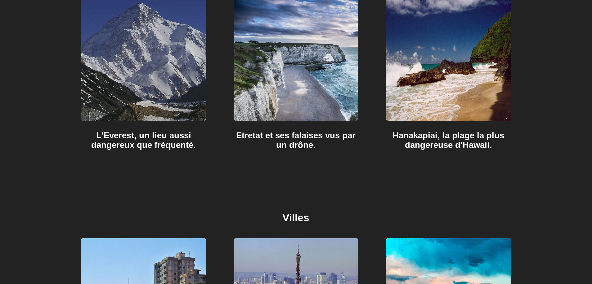
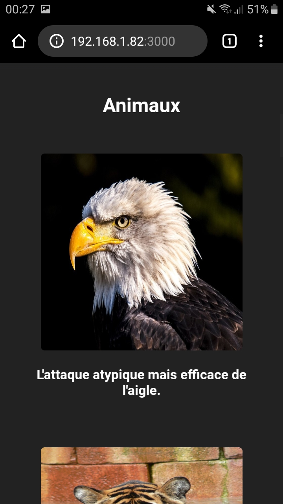

# gflix
Un site à mi-chemin entre Youtube et Netflix (dont je me suis inspiré du design) qui permet de rechercher et voir des vidéos, voir les commentaires et commenter soi-même. Codé avec ReactJS et utilisant NodeJS, ExpressJS et MongoDB comme côté serveur.

